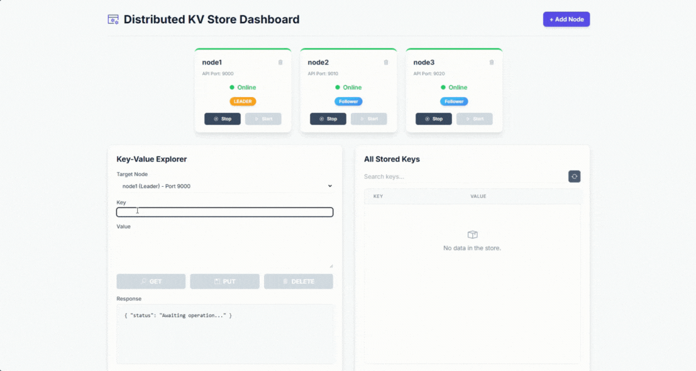

# Axon: A Raft-Powered, Fault-Tolerant Distributed Datastore

A production-grade, fault-tolerant distributed key-value store built in Go. This project provides a horizontally scalable storage solution that ensures data consistency and high availability using the Raft consensus algorithm. It features a modern Svelte UI for real-time cluster management and data exploration.

-----

## ✨ Core Features

  * **Distributed CRUD Operations:** Simple `PUT`, `GET`, and `DELETE` operations distributed across a multi-node cluster.
  * **Strong Consistency:** Guarantees data consistency across all nodes using the Raft consensus protocol. All writes are committed by a leader and replicated to a majority of nodes.
  * **High Availability & Fault Tolerance:** The system can tolerate node failures. If a leader node fails, the cluster automatically elects a new leader with no data loss.
  * **Horizontal Scalability:** Easily scale the cluster by adding new nodes. The system is designed to handle new nodes joining a live cluster.
  * **Persistent Storage:** Utilizes BoltDB for durable, on-disk storage with ACID guarantees, ensuring data survives node restarts.
  * **Live Management Dashboard:** A modern, real-time web UI built with Svelte allows you to:
      * View the status of all nodes (leader, follower, online/offline).
      * Add new nodes to the cluster dynamically.
      * Stop, restart, and decommission nodes.
      * Explore and manage key-value data directly.

-----

## 🛠️ Technology Stack

### Backend

  * **Go:** The core language for the backend application.
  * **HashiCorp Raft:** The underlying library for implementing the Raft consensus algorithm, providing leader election and replicated log management.
  * **Gin:** A high-performance HTTP web framework for the API.
  * **BoltDB:** An embedded, persistent key/value database for Go.
  * **HashiCorp Memberlist:** A library for cluster membership and node discovery using a gossip-based protocol.

### Frontend

  * **SvelteKit:** A powerful UI framework for building fast, modern web applications.
  * **Tailwind CSS:** A utility-first CSS framework for rapid UI development.
  * **Vite:** The next-generation frontend tooling for a blazing-fast development experience.

-----

## 🛡️ A Robust & Resilient System

This project was built to be exceptionally resilient. Significant effort has gone into identifying and fixing complex distributed systems bugs to make the cluster as foolproof as possible.

### Split-Brain Prevention

A critical failure mode in distributed systems is "split-brain," where a network partition or faulty recovery logic causes two separate leaders to emerge, leading to data inconsistency.

  * **Solved:** The cluster launcher is now intelligent. It will **never** bootstrap a new node as a leader if a cluster configuration already exists (even if all nodes are offline). This ensures that a new, independent cluster can't be accidentally created, forcing all nodes to reconcile with the original cluster's state.

### Graceful Quorum Loss & Recovery

The system correctly handles losing a majority of its nodes (quorum loss), which is the point where a leader can no longer be elected.

  * **Solved:** When quorum is lost, the remaining nodes safely transition to a follower state and reject writes, preventing data divergence. The system provides a clear recovery path: simply restart one of the original offline nodes to re-establish a majority and automatically elect a new leader.

### Persistent Node Joining

In a dynamic cluster, a new node might try to join while the leader is temporarily unavailable or in the middle of an election.

  * **Solved:** A new node now persistently retries its join request in the background. It will continue attempting to connect every few seconds until it can successfully reach the cluster's leader. It's also smart enough to handle redirects if it initially contacts a follower node, ensuring it always finds its way to the true leader.

-----

## 🚀 Getting Started

### Prerequisites

  * **Go** (version 1.21 or newer)
  * **Node.js and npm** (for building the UI)

### Installation & Launch

1.  **Clone the Repository**

    ```bash
    git clone <your-repo-url>
    cd distributed-key-value-store
    ```

2.  **Build the Frontend UI**
    This step compiles the Svelte application into static assets that the Go backend will serve.

    ```bash
    cd ui-svelte
    npm install
    npm run build
    cd ..
    ```

3.  **Tidy and Run the Cluster Launcher**
    From the project's **root directory**, tidy the Go modules and then run the launcher. It will automatically build the server binary, start a 3-node cluster, and host the UI.

    ```bash
    go mod tidy
    go run ./cmd/kv-launcher/main.go
    ```

4.  **Open the Dashboard**
    Once the launcher is running, open your browser and navigate to:
    **http://localhost:8080**

-----

## 💻 API Usage

While the UI is the primary way to interact with the cluster, you can also use the REST API directly with tools like `curl`.

### Public Key-Value API

These endpoints can be called on **any active node** in the cluster. If you call a follower node, your request will be automatically forwarded to the leader. Replace `9000` with the API port of any online node.

#### Put a Key-Value Pair

Stores or updates a value for a given key.

  - **Method:** `PUT`
  - **Path:** `/kv/:key`
  - **Body:** JSON object with a `value` field.

<!-- end list -->

```bash
curl -X PUT -H "Content-Type: application/json" \
  -d '{"value":"is a distributed systems algorithm"}' \
  http://localhost:9000/kv/raft
```

#### Get a Key

Retrieves the value for a given key.

  - **Method:** `GET`
  - **Path:** `/kv/:key`

<!-- end list -->

```bash
curl http://localhost:9000/kv/raft
```

#### Delete a Key

Removes a key and its value from the store.

  - **Method:** `DELETE`
  - **Path:** `/kv/:key`

<!-- end list -->

```bash
curl -X DELETE http://localhost:9000/kv/raft
```

#### Get All Keys

Retrieves all key-value pairs from the store. Note: This reads from the local state of the queried node.

  - **Method:** `GET`
  - **Path:** `/kv`

<!-- end list -->

```bash
curl http://localhost:9000/kv
```

-----

### Launcher Control API

These endpoints are called on the **launcher application** (running on port `8080`) to manage the node processes and the cluster's configuration.

#### Get All Node Statuses

Returns a list of all configured nodes and their current status (online/offline, leader/follower).

  - **Method:** `GET`
  - **Path:** `/api/control/nodes`

<!-- end list -->

```bash
curl http://localhost:8080/api/control/nodes
```

#### Add a New Node

Dynamically adds a new node to the cluster. The launcher assigns it the next available ports, starts the process, and instructs it to join the cluster leader.

  - **Method:** `POST`
    \--   **Path:** `/api/control/add`
  - **Body:** JSON object with a `node_id` field.

<!-- end list -->

```bash
curl -X POST -H "Content-Type: application/json" \
  -d '{"node_id":"node5"}' \
  http://localhost:8080/api/control/add
```

#### Stop a Node

Stops a running node process gracefully.

  - **Method:** `POST`
  - **Path:** `/api/control/stop/:nodeID`

<!-- end list -->

```bash
curl -X POST http://localhost:8080/api/control/stop/node5
```

#### Start a Node

Restarts a stopped node. The node will attempt to rejoin the cluster.

  - **Method:** `POST`
  - **Path:** `/api/control/start/:nodeID`

<!-- end list -->

```bash
curl -X POST http://localhost:8080/api/control/start/node5
```

#### Decommission a Node

Permanently removes a node from the cluster configuration. The launcher will tell the leader to remove the node from the consensus group, stop the process, and delete its data directory.

  - **Method:** `POST`
  - **Path:** `/api/control/delete/:nodeID`

<!-- end list -->

```bash
curl -X POST http://localhost:8080/api/control/delete/node5
```
-----

### 🚀 Application in Action

